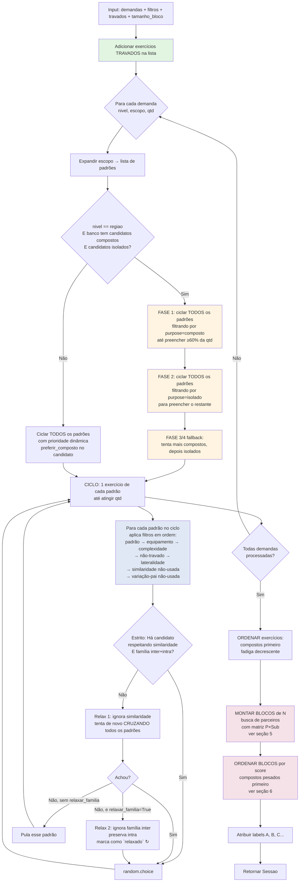

# Lógica do Gerador de Treinos

> Mapa de referência das decisões internas do `gerador_treino.py`.
> Use este documento como guia para entender o pipeline antes de mudar qualquer regra.

---

## 1. Visão geral em uma frase

O gerador funciona em **três camadas sequenciais**: **(1) seleção** dos exercícios a partir das demandas, **(2) montagem** dos blocos (super séries) com regras de pareamento, e **(3) ordenação** dos blocos na sessão final.

Cada camada tem sua própria hierarquia de prioridades — todas elas usam a mesma escada de fallbacks: tenta a regra mais restritiva, e se não houver candidatos suficientes, relaxa um nível por vez até preencher.

---

## 2. Hierarquia estrutural (Região → Subregião → Padrão)

Toda demanda é eventualmente reduzida a uma lista de **padrões**, que é a unidade atômica de seleção.

| Região | Subregião | Padrões |
|---|---|---|
| **lower** | perna_anterior | `squat` |
| | perna_posterior | `hinge`, `knee_flexion`, `abduction` |
| | adutores | `adduction` |
| | panturrilha | `flexao_plantar` |
| **upper** | peito | `empurrar_compostos`, `empurrar_isolados` |
| | costas | `remadas`, `puxadas` |
| | ombro | `ombro_composto`, `ombro_isolado`, `posterior_ombro` |
| | braços | `biceps`, `triceps` |
| **core** | core | `core_isometrico`, `core_dinamico` |
| **cardio** | cardio | `cardio` |

**Classificação composto vs isolado é por EXERCÍCIO** via campo `purpose` do banco, não por padrão. `PURPOSE_COMPOSTO = {"compound", "explosive"}` (em `gerador_treino.py`). Padrões mistos no banco — `hinge` (12 compound + 8 isolation), `squat` (16 compound + 1 isolation, ex: Cadeira Extensora), `puxadas` (5 + 2), `adduction` (1 + 2) — contribuem em ambas as fases da regra 60% em região (item 4.2). A constante `PADROES_COMPOSTOS` foi descontinuada como critério de seleção.

---

## 3. Fluxo principal de decisão

---

## 4. Camada 1 — Seleção de exercícios

### 4.1. Pipeline de filtros (ordem de aplicação)

Aplicados em sequência para cada padrão dentro do ciclo. Filtros 1-5 são **hard** (exclusão obrigatória); 6-7 são **soft** (relaxáveis em níveis).

| # | Filtro | Função | Hard / Soft |
|---|---|---|---|
| 0 | **Travados** entram primeiro | Inclusão obrigatória antes de qualquer seleção | — |
| 1 | `padrao == X` | `filtrar_por_padrao` | Hard |
| 2 | Equipamento bloqueado | `filtrar_por_equipamentos` | Hard |
| 3 | `complexidade ≤ máx` | `filtrar_por_complexidade` | Hard |
| 4 | Nome já usado na sessão | check via `nomes_usados` | Hard |
| 5 | Lateralidade (se especificada) | `unilateral == "bilateral"` ou `"unilateral"` | Hard |
| 5b | `filtro_purpose` (composto/isolado) ou `preferir_composto` | `_eh_composto(e)` via campo `purpose` do exercício | Hard quando `filtro_purpose` setado; Soft quando `preferir_composto` |
| 6 | **Similaridade não usada** | `similaridade not in similaridades_usadas` (intra-sessão) | **Soft** — relax 1 |
| 7 | **Família já usada** (inter+intra) | `variacao_de not in var_pais_inter ∪ var_pais_intra` | **Soft (inter only)** — relax 2, só se `relaxar_familia=True` |
| 8 | Escolha final | `random.choice` entre os que sobraram | — |

A relaxação acontece em **3 níveis**, e crucialmente **cruza todos os padrões em cada nível antes de descer pro próximo**: estrito em todos os padrões → relax 1 (sem similaridade) em todos → relax 2 (sem família inter) em todos. Isso evita que um padrão "esgotado" seja preenchido via relax enquanto outro padrão do mesmo escopo ainda teria opção estrita disponível. Exercícios escolhidos no relax 2 vão pra `Sessao.relaxados` (badge `↻` no UI) e geram aviso `tipo: "familia_repetida"`.

### 4.2. Hierarquia de seleção em demandas de **região**

Quando o nível é `regiao` E o escopo tem candidatos compostos E isolados (verificado dinamicamente no banco via `_eh_composto`), vale a regra de proporção (`PROPORCAO_COMPOSTOS = 0.6`):

| Fase | Ação | Quando para |
|---|---|---|
| **1** | Cicla **todos os padrões do escopo** com `filtro_purpose="composto"` (só candidatos com `_eh_composto(e)=True`) | `min_compostos = ceil(qtd × 0.6)` preenchidos, ou compostos esgotaram |
| **2** | Cicla **todos os padrões do escopo** com `filtro_purpose="isolado"` (só candidatos com `_eh_composto(e)=False`) | `qtd - min_compostos` preenchidos, ou isolados esgotaram |
| **3** | (fallback) Volta a ciclar com `filtro_purpose="composto"` para preencher o que sobrou | qtd total atingida, ou compostos esgotaram |
| **4** | (último fallback) Cicla com `filtro_purpose="isolado"` se ainda falta | qtd atingida ou isolados esgotaram |

**Cada padrão pode contribuir nas 2 fases.** Ex: `hinge` aparece na Fase 1 com seus 12 compounds (Stiff, Levantamento Terra etc.) e na Fase 2 com seus 8 isolations (Hiperextensão, Hip Thrust etc.). Idem `squat` com Cadeira Extensora na Fase 2.

**Exemplo**: demanda `("regiao", "lower", 6)`
- Padrões = `[squat, hinge, knee_flexion, abduction, adduction, flexao_plantar]` (shuffled)
- min_compostos = ceil(6 × 0.6) = 4 compostos
- Fase 1: cycla os 6 padrões pegando candidatos compound. Apenas `squat`, `hinge`, `adduction` têm compounds → ciclo distribui 4 picks entre eles
- Fase 2: cycla os 6 padrões pegando candidatos isolation. Todos têm exceto `empurrar_compostos`, `remadas`, `ombro_composto` (mas esses não estão em lower) → 2 picks distribuídos entre os 6 padrões de lower

### 4.3. Hierarquia de seleção em demandas de **subregião** ou **padrão**

Sem regra de proporção forçada. Cycle de padrões com prioridade dinâmica + preferência por composto no nível do candidato:

1. `_ordenar_padroes_por_prioridade(padroes, banco=banco)`: padrões que **têm pelo menos 1 candidato composto disponível no banco** vêm primeiro (shuffle dentro de cada grupo). Padrões puramente isolation entram depois.
2. `_selecionar_ciclando(..., preferir_composto=True)`: dentro de cada padrão, prefere candidatos com `_eh_composto(e)=True`; se não houver, cai para isolados do mesmo padrão.
3. Cicla pegando 1 exercício de cada padrão; volta ao primeiro até atingir qtd.

Ex: `peito(2)` → cycle = `[empurrar_compostos, empurrar_isolados]` → 1 composto de empurrar_compostos + 1 isolado de empurrar_isolados. `perna_posterior(3)` → cycle = `[hinge, knee_flexion, abduction]` (hinge primeiro porque tem composto) → 1 hinge composto + 1 knee_flexion isolation + 1 abduction isolation.

### 4.4. Detalhe sobre lateralidade

Se o `lateralidade_por_padrao` traz refinamento bilateral/unilateral para um escopo (ex: `{"hinge": {"bilateral": 1, "unilateral": 1}}`), cada lateralidade vira uma **sub-demanda separada** que cicla pelos mesmos padrões aplicando o filtro de lateralidade. Isso é processado *antes* da regra de proporção composto/isolado.

---

## 5. Camada 2 — Montagem de blocos (super séries)

Após a seleção, os exercícios são ordenados (compostos primeiro, fadiga decrescente) e o algoritmo monta blocos pegando o primeiro não-usado como **âncora** e buscando parceiros via matriz de prioridades em `_buscar_candidato`.

### 5.1. Matriz de prioridades P × Sub (16 combinações testadas em ordem)

A busca varre **linha por linha**: P1.Sub1 → P1.Sub2 → P1.Sub3 → P1.Sub4 → P2.Sub1 → ... → P4.Sub4. Para no primeiro candidato que passa.

#### Eixo geográfico (linhas)

| Prioridade | Critério | Objetivo |
|---|---|---|
| **P1** | Região diferente **E** padrão diferente | Máxima distância muscular |
| **P2** | Região diferente | Distância por região |
| **P3** | Padrão diferente | Distância por padrão (mesma região) |
| **P4** | Qualquer válido | Fallback total |

#### Eixo qualitativo (colunas)

| Sub | Critério | Por quê |
|---|---|---|
| **Sub1** | Não-agonista **E** parceiro composto | Bloco mais "pesado" e equilibrado |
| **Sub2** | Não-agonista | Distância funcional push/pull |
| **Sub3** | Parceiro composto | Compostos atraem compostos para abrir o treino forte |
| **Sub4** | Sem restrição | Último recurso |

> **"Parceiro composto"** = candidato com `purpose == "compound"`. Compostos buscam compostos para formar blocos pesados (P1+P2 da seção 6); isolados também buscam compostos para superset equilibrado.

> **"Não-agonista"** = candidato em grupo `push/pull/quad/hamstring/...` diferente do que já está no bloco. O grupo vem de `GRUPO_MUSCULAR_PADRAO` (push = peito + ombro + tríceps; pull = costas + posterior_ombro + bíceps; etc.).

> A regra de não-agonista **só é aplicada se `evitar_agonistas=True`**. Quando desligada, Sub2 e Sub4 ficam equivalentes; Sub1 e Sub3 também.

### 5.2. Restrições obrigatórias dentro de qualquer prioridade

Aplicadas em `pode_adicionar_ao_bloco` e nas duas passadas de `montar_blocos`:

| Restrição | Regra | Pode relaxar? |
|---|---|---|
| **Fadiga alta** | Em blocos de 2: máx 1 exercício com `fadiga ≥ 4` (`FADIGA_MAX_PAR`). Em blocos de 3: máx 2. | Não |
| **Dois unilaterais** | Em blocos de 2: primeira passada rejeita unilateral se já tem um no bloco | **Sim** — segunda passada permite |
| **Não-agonista** | Só ativa se `evitar_agonistas=True` | Não direta — mas Sub3/Sub4 ignoram |

### 5.3. Sequência completa em `montar_blocos`

1. Pega o primeiro exercício não-usado como **âncora** do bloco.
2. Tenta achar parceiro **com** restrição de unilateral (se tamanho ≤ 2).
3. Se não achou, tenta **sem** restrição de unilateral.
4. Se ainda não achou, fecha o bloco com o que tem (último bloco pode ter 1 só).
5. Repete até esgotar exercícios.

---

## 6. Camada 3 — Ordenação dos blocos na sessão

Após todos os blocos montados, são reordenados por **score decrescente** (soma dos scores individuais).

### 6.1. Score de exercício individual

| Tipo | Fórmula | Faixa |
|---|---|---|
| Composto (`purpose == "compound"`) | `10 + fadiga` | **11 – 15** |
| Isolado de braço (`biceps` ou `triceps`) | `fadiga × 0.1` | 0.1 – 0.5 |
| Isolado de outros grupos | `fadiga × 0.5` | 0.5 – 2.5 |

### 6.2. Por que o pulo de 10 no composto

A base 10 é **matematicamente** projetada para garantir que **qualquer** bloco com 2 compostos pontue acima de **qualquer** bloco com 1 composto, independente das fadigas. Resultado típico de uma sessão:

| Posição | Composição típica | Score |
|---|---|---|
| Bloco A (1º) | 2 compostos pesados | 22 – 30 |
| Bloco B (2º) | 2 compostos | 22 – 28 |
| Bloco C | 1 composto + 1 isolado de grupo grande | 11.5 – 17.5 |
| Bloco D | 1 composto + 1 isolado de braço | 11.1 – 15.5 |
| Bloco E (último) | 2 isolados | 1.0 – 5.0 |

Isso traduz a regra implícita: **abrir o treino com o que pesa, fechar com o que é leve**.

---

## 7. Constantes ajustáveis (pontos de tunagem)

Esses são os botões que você gira quando quer mudar comportamento sem reescrever lógica.

| Constante | Default | O que controla | Onde mexer |
|---|---|---|---|
| `PROPORCAO_COMPOSTOS` | 0.6 | % mínimo de compostos em demandas de região | Topo do arquivo |
| `PURPOSE_COMPOSTO` | {compound, explosive} | Quais valores de `purpose` contam como composto | Topo do arquivo |
| `FADIGA_MAX_PAR` | 4 | Limite que conta como "fadiga alta" para regra de pareamento | Topo do arquivo |
| `TAMANHO_BLOCO_PADRAO` | 2 | Tamanho default do bloco (super série) | Topo do arquivo |
| `PADROES_COMPOSTOS` | 6 padrões | **DEPRECATED** — não é usada na lógica de seleção. Mantida apenas por retrocompat de import | Topo do arquivo |
| `GRUPO_MUSCULAR_PADRAO` | dict | Mapa padrão → grupo (push/pull/quad/...) usado pela regra de agonistas | Topo do arquivo |
| `_PADROES_BRACO` | {biceps, triceps} | Quais padrões recebem score reduzido (0.1×) na ordenação | Próximo a `_score_exercicio` |

---

## 8. Sumário das hierarquias (resposta direta à pergunta)

A pergunta foi **"qual a hierarquia de prioridade dos filtros"**. Existem **5 hierarquias distintas** no app, cada uma operando em um momento diferente:

| # | Hierarquia | Onde atua | Mais alto | Mais baixo |
|---|---|---|---|---|
| 1 | **Hierarquia estrutural** | Expansão de demandas | Padrão (atomico) | Região (mais amplo) |
| 2 | **Hierarquia de inclusão** | Antes da seleção | Travados | Selecionados pelo gerador |
| 3 | **Hierarquia de filtros de candidatos** | Durante a seleção | Hard filters (1–6) | Soft filter (similaridade) |
| 4 | **Hierarquia de pareamento** | Montagem de blocos | P1.Sub1 (≠região E ≠padrão E não-agonista E composto) | P4.Sub4 (qualquer um válido) |
| 5 | **Hierarquia de ordenação dos blocos** | Pós-montagem | Score alto (compostos pesados) | Score baixo (isolados de braço) |

Quando o app **não** entrega o que você esperava, a causa quase sempre é uma dessas 5 hierarquias relaxando uma camada por falta de candidatos. Os logs internos (já presentes em `selecionar_sem_repeticao_similaridade`) deixam rastro disso.

---

## 9. Pontos sensíveis para evolução futura

Áreas onde pequenos ajustes têm grande efeito sobre a qualidade dos treinos gerados:

- **`PROPORCAO_COMPOSTOS`** — subir para 0.7 deixa treinos mais "pesados"; baixar para 0.5 abre mais espaço para isolados.
- **`PURPOSE_COMPOSTO`** — controla o que conta como composto. Hoje `{compound, explosive}`. Se quiser tratar `explosive` como categoria à parte, basta tirar do set.
- **`FADIGA_MAX_PAR`** — subir para 5 permite parear exercícios mais pesados; baixar para 3 espalha mais a fadiga.
- **Regra de agonistas (`evitar_agonistas`)** — hoje é opcional. Considerar tornar default em sessões "Empurrar+X" e "Puxar+X" onde o risco de superset agonista é maior.
- **Score de braço (×0.1)** — esse multiplicador determina que braço **sempre** vem por último. Se quiser priorizar braço em sessões específicas, esse é o lugar.
- **`selecionar_sem_repeticao_similaridade`** relaxa silenciosamente. Vale logar quando isso acontece para identificar lacunas no banco (ex: "padrão X só tem 2 grupos de similaridade — precisa cadastrar mais").

---

*Documento de referência da lógica do `gerador_treino.py`. Mantido alinhado com o código.*
